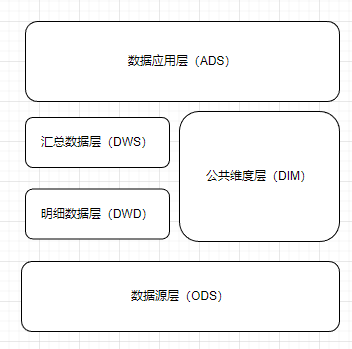

# 数据仓库

## 特点

面向主题：为数据分析提供服务，根据主题将原始数据集合在一起

集成：原始数据来源于不同的数据源，要整合成最终数据，需要经过抽取、清洗、转换的过程

非易失：保存的数据是一系列历史快照，不允许被修改，只运行通过工具进行查询与分析

时变性：数仓会定期接受、集成新的数据，从而反映出数据的最新变化

## 与数据库的差别

- 数据库面向事物设计，属于OLTP（在线事务处理）系统，主要操作是随机读写，在设计时尽量避免冗余，常采用符合范式规范来设计
- 数据仓库是面向主题设计的，属于OLAP（在线分析处理）系统，主要操作是批量读写，关注数据整合，以及分析、处理性能；会有意引入冗余，采用反范式方式设计

|      | 数据库         | 数据仓库          |
| ---- | ----------- | ------------- |
| 面向   | 事务          | 分析            |
| 数据类型 | 细节、业务       | 综合、清洗过的数据     |
| 数据特点 | 当前的、最新的     | 历史的、跨时间维护     |
| 目的   | 日常操作        | 长期信息需求、决策支持   |
| 设计模型 | 基于ER模型，面向应用 | 星型/雪花模型，面向主题的 |
| 操作   | 读/写         | 大多为读          |
| 数据规模 | GB~TB       | >= TB         |

## 常见架构

### MPP

### 分布式

## 常见数仓

传统数据仓库：Oracle RAC， DB2， Teradata，Greenplum

大数据数据仓库：Hive，SparkSQL，HBase，Impala，HAWQ，TIDB

# 架构

数据仓库的整体架构可以分为四块内容：架构图、ETL流程、数据积存与数据分析

## 架构图

通常分为四层，由底往上是ETL，操作数据源层ODS，公共维度模型层CDM，数据应用层ADS

其中CDM细分两层，数据汇总层DWS和数据明细层DWD。该层的数据主要是为数据分析服务的，数据模型建设也在这一层

## ETL流程—— Extract-Transform-Load

将数据从来源端经过抽取、转换、加载至目的端的过程，是构建数据仓库的重要一环。ETL规则的设计和实施约占整个数据仓库搭建工作量的60%~80%

### Extraction

抽取的数据源可以分为结构化数据、非结构化数据、半结构化数据。结构化数据一般采用JDBC、数据库日志方式，非/半结构化数据会监听文件变动

**抽取方式**

- 数据抽取方式有全量同步、增量同步两种方式
- 全量同步会将全部数据进行抽取，一般用于初始化的数据装载
- 增量同步方式会检测数据的变动，抽取发生变动的数据，一般用于数据更新

### Transformation

数据转换要经历数据清洗和转换两个阶段

- 数据清洗主要是对出现的重复、二义性、不完整、违反业务或逻辑规则等问题的数据进行统一处理
- 数据转换主要是对数据进行标准化处理，进行字段、数据类型、数据定义的转换

结构化数据在转换过程中的逻辑较为简单，非/半结构化数据的转换比较复杂

### Loading

将最后处理完的数据导入到对应的目标源中

### 常见的ETL工具

**对结构化数据的ETL工具**：

Sqoop，Kettle，Datastage，Informatica，Kafka

**对非/半结构化数据ETL工具**：

Flume，Logstash

## 数据积存

### 数据操作层ODS

​        数据与原业务数据保持一致，可以增加字段用来进行数据管理。并且存储的历史数据是只读的，提供业务系统查询使用

​        在离线数仓中，业务数据定期通过ETL流程导入到ODS中，导入方式有全量、增量两种

- 全量导入：通常在数据第一次导入时
- 增量导入：每次只需要导入新增、更改的数据，建议使用外连接&全覆盖方式，可以有效减少冗余

## 数据分析

### 数据明细层DWD

DWD对ODS层的数据进行清洗、标准化、维度退化。数据仍然满足3NF模型，为分析运算做准备

### 数据汇总层DWS

DWS的数据对DWD的数据，按照主题进行计算汇总，存放便于分析的宽表，是面向主题的一个体现。

存储模型并非3NF，而是注重数据聚合，复杂查询、处理性能更优的数仓模型。如维度模型。

### 数据应用层ADS

ADS也被称为数据集市。存储数据分析结果，为不同业务场景提供接口，减轻数据仓库的负担。

# 建模方法

## 基本概念

### OLTP系统建模方法

​        **OLTP（Online Transaction Processing，在线事务处理）的核心是面向业务，支持业务，支持事务。**

        系统中，主要操作是随机读写。并且为了保证数据一致性、减少冗余，通常使用关系模型，使用三范式规则来减少冗余。

### OLAP

​        OLTP（Online Analytical Processing，在线联系分析）**是面向分析、支持分析的系统**。

        系统中，主要操作是复杂分析查询；关注数据整合，以及分析、处理的性能。根据存储方式的不同又分为ROLAP，MOLAP，HOLAP

- ROLAP（Relation）：使用关系模型构建
- MOLAP（Multidimensional）：预先聚合计算，使用多维数组的形式保存数据结果，加快查询分析时间
- HOLAP（Hybrid）：ROLAP和MOLAP两者的集成，如低层是关系型的，高层是多维矩阵型的；查询效率高于ROLAP，低于MOLAP

## ROLAP

​        典型的数据仓库建模方法有ER模型、维度模型、Data Value模型、Anchor模型四种。其中DV和Anchor模型其实都是源自ER模型，实施周期较长，适合已经成熟，变动已经不频繁的数据仓库。而常用的还是**灵活的维度模型**

### 维度模型

​        维度模型中，表被分为**维度表**和**事实表**两种，维度是对事实的一种组织。常见的维度有分类、时间、地域等。

​        维度模型分为星型模型、雪花模型、星座模型。建立后方便对数据进行多维分析

**星型模型**：标准的星型模型，维度只有一层，分析性能最优

**雪花模型**：有多层维度，比较接近三范式的设计，较为灵活

**星座模型**：基于多个事实表，它们之间会共享一些维度表。是大型数据仓库种的常态，是业务增长的结果，与模型设计无关。

### 宽表模型

​        是维度模型的衍生，适合join性能不佳的数据仓库产品。它将维度冗余到事实表种，形成宽表，以此减少join操作提高查询性能

## 表的类型

### 事务事实表

​        顾名思义，是用来记录事务层面的事实数据，保存的是最原始的，也称“原子事实表”。

### 周期快照事实表

​        以具有规律性的、可预见的时间间隔来记录事实，统计间隔内的度量。是在事物事实表之上建立的聚集表

### 累计快照事实表

​        表示记录不确定周期的数据，通常是完全覆盖一个事务或产品的生命周期，且具有多个时间字段。

## OLAP工具

# 数据治理

        数据治理主要是为了让数据更加的系统化、规范化，是组织中设计数据使用的一整套管理行为，**提高数据质量，发挥数据资产价值**。

## 目的

- 降低风险

- 建立数据使用的内部规则

- 实施合规要求

- 改善内部和外部的沟通

- 增加数据价值

- 方便数据管理

- 降低成本

- 通过风险管理和优化来帮助确保公司的持续生存
